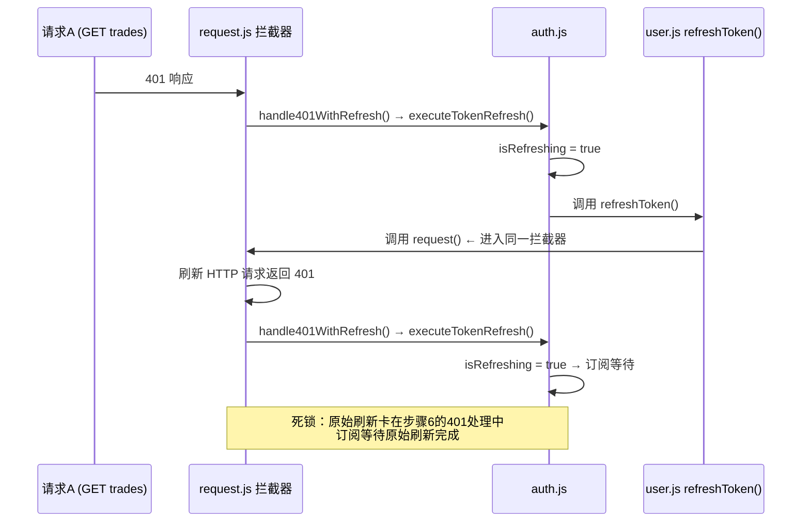

## 要求分析

修复三个问题：

1. **401 无限循环死锁**：`GET /api/user/resale/artwork/37/trades` 返回 401，触发 `POST /api/user/auth/refresh`，但 refresh 也返回 401，后续请求循环打印 `[Auth] 已有刷新在进行，等待结果...`

2. **404 API 错误**：`GET /api/artist/score/47` 返回 404，以 error 级别记录但调用方已有 try/catch，日志污染严重

3. **下单接口受阻**：`POST /api/order/orders/direct` 在刷新循环期间也卡住

## 核心要求

- 刷新 token 的请求必须绕过 401 拦截器，避免递归死锁
- refresh 接口返回 401 时立即清除 token 并强制跳转登录，不再尝试冷却重试
- 404 需优雅处理，不显示 error 级日志，不破坏 UI
- 新请求应等待单个合法的刷新结果，而非循环等待

## 技术方案

### 根因分析

**死锁链路（当前代码路径）**：



### 修复策略

**核心方案**：刷新 Token 的 HTTP 请求完全绕过 request.js 的 401 拦截器，使用原生 `uni.request` 直接发送。

### 技术选型

- 前端：Vue.js + uni-app（现有项目，不引入新依赖）
- 架构模式：请求拦截器 + 原生 HTTP 客户端 + 单例刷新状态机

### 架构设计

```
┌─────────────────┐     ┌───────────────────┐     ┌─────────────────┐
│  业务 API 调用    │────▶│  request.js 拦截器  │────▶│   uni.request   │
│  (resale/order)   │     │  401 处理          │     │                 │
└─────────────────┘     └────────┬──────────┘     └─────────────────┘
                                 │
                          ┌──────▼──────┐
                          │ auth.js     │
                          │ executeToken│
                          │ Refresh()   │
                          └──────┬──────┘
                                 │
                          ┌──────▼──────┐
                          │ auth.js     │
                          │ rawRefresh  │  ← 使用原生 uni.request，绕过拦截器
                          │ Request()   │
                          └─────────────┘
```

### 性能与可靠性

- **免死锁**：原生请求不受拦截器影响，refresh 的 401 直接在 `executeTokenRefresh` 的 catch 块中处理
- **永久死亡标记**：refresh 401 是终态，设置永久标记阻止后续所有尝试
- **并发控制**：`isRefreshing` 单例保证同一时刻只有一个刷新在途，后续请求订阅等待
- **404 保护**：降级为 `log.warn`，不污染 error 日志

### 目录结构

```
frontend/src/
├── api/
│   ├── request.js              # [MODIFY] 添加 rawRefreshRequest() 绕过拦截器；404 降级 warn
│   └── user.js                 # [MODIFY] refreshToken() 改用 rawRefreshRequest()
├── utils/
│   └── auth.js                 # [MODIFY] 移除冷却机制；refresh 401 时永久死亡标记
└── pages/
├── artist/
│   └── score.vue            # [MODIFY] 404 时不弹出 toast
└── gallery/
└── detail.vue           # [MODIFY] 401 修复后确保 loadArtistScore 404 不报 toast

## Agent 扩展使用

（无需要使用的扩展）